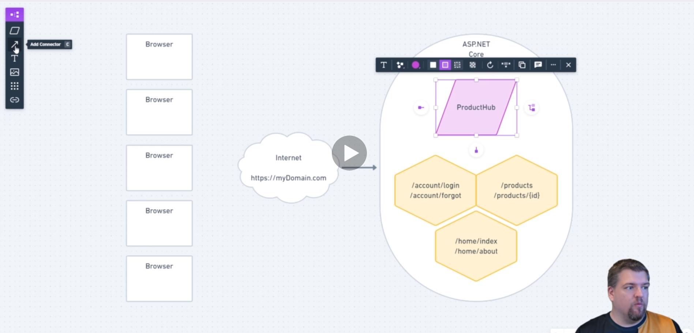

What is signalr?

  server              >                clients
  Inventory           >   A B C E F E D

The idea of continous state
We have two way of communication betwee the client and the server.

There a different way to do this?

How would you manage the connections. ?

   Phones , Physical devices and Web application

Signalr is a real time communication for dotnet application.

### Other topics for later

cors
streaming
protecting endpoints and authoriaztion
hub filters
Azure signalr service
Sefhosted signalr servers
Signalr with azure functions
interviews

### Hub

What is a hub ?

A central point of connection for all the request coming to our application.

### you could have product hub

The signalr  connection is a two way communication called a duplex stream.
Each client have a connection with the producthub. 
The product will send message to all the clients that some product have changed.

What is a hub now, we're going to talk about this concept of hubs throughout the entire course.

So this is the section where we really define what that is now looking at your screen.

I am assuming you're already familiar with one of the simple concepts, such as a Hispanic core MVC model view controller.

And if you understand, MVC making the jump to hubs is really straightforward.

Now, think of it this way, looking at our fake application here in the diagram.

If I make a request to my domain dot com slash account slash login, that's going to go into the as

Pete UNICOR application, the routing engine is going to send it to my account controller and it's going

to execute a method on that account controller called login.

Awesome.

If I make a call to products something, it's going to go through the Internet into my ESPN UNICOR application

and then get routed to a product's controller.

Pretty straightforward and signal are we have this concept of a hub now?

A hub is very similar to an mvc controller.

It's a central point of connection for all the requests coming into our application.

Let's create a hub in our application.

We'll call this one product hub because maybe we want real time product updates from our application

when one of our clients in this case, it's browsers connect to our application via signal.

Ah, this is going to happen in this sort of process where the browser makes a request through the Internet

to our ESPN core app saying I would like to connect to the product hub.

Now, when this is done with a WebSocket, it's essentially a one to one connection from the client

into the hub.

And this is a two way connection.

Any time the browser, the client wants to send a message to the hub, it uses that existing pipe.

Likewise, any time the server or the hub wants to send a request back to the client, it uses the same

pipe.

Now, every client makes its own unique connection into this hub.

Oh, there we go, every connection comes into this hub.

Well, let's look at all these connections.

Each client has a connection into the product hub and let's discuss a theoretical workflow.

I do something inside of the application through one of my MVC controllers.

My MVC controller needs to tell everyone that's currently looking at a list of products or a particular

product that something is updated inside the product list.

What it will do is it will use the existing product hub and tell it, send a message to all your clients.

That's Product X, Y, Z has changed.

Well, the product hub is similar and similar.

Smart enough to know everything that is currently connected to it and will send a message accordingly

to all those clients.

So client one client to client three and so on will all get the same message that something has occurred.

Additionally, all these clients, they could say, I would like to make an update to a particular product

so they can use their existing connection to send that message up the stream into the product hub and

the product hub could go could go do that work.

Now, later on, we're going to have the discussion of when should you use an NBC controller or some

sort API or when should you use signal are to do all this heavy lifting for you is a real fine balance

and really comes to how much you want your signal our hubs to do.

But we'll cover that later.

But really, in conclusion, SIGNALER hubs are your single point of connection into the application,

you can have even multiple hubs.

So let's say we have our product hub here.

Let's move.

Let's move that over to the side and let's create another hub.

And we'll call it.

Account Hubb.

Now, Count Hubb only is going to work with account based notifications, and not all clients will necessarily

need to connect to the account hub.

So here's a case.

Maybe the first client will want to connect to the client.

To the account hub, or maybe the last client will want to connect to the account hub.

The best part about having hubs is that not all the clients need to connect to them in order for them

to work.

Your clients can selectively connect to any hubs that you have available.

In addition to that, we'll talk later about authorisation and authentication.

We can control who has access to what hubs and what methods on there, those hubs that they have.

Now, let's go and take a break.

We'll walk through a practical example of a hub in creating a connection to that hub.

#### Lets create a signalr server

