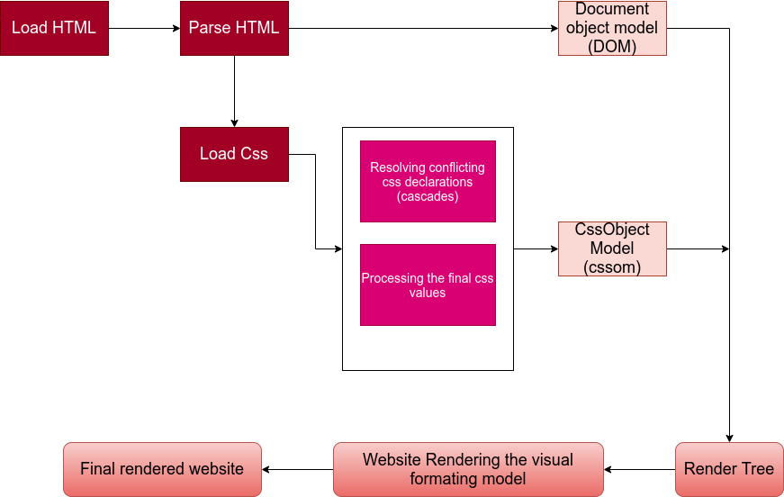

##### Advanced Css

### How Css Works

### Three Pillars of Writting Good Css

1. Responsive Design.
2. Writing Maintainable and scalable code.
3. Web Performance.


#### Responsive Design

Responsive is a standard today. 

 1. Fluid layouts
 2. Media queries
 3. Responsive Images
 4. Correct Units
 5. Desktop-first vs Mobile first


 #### Maintainable and scalable code

 1. Clean
 2. Easy to understand
 3. Growth
 4. Reusable
 5. How to Organize Files
 6. How to name classes
 7. How to Structure Html.

 ### Web Performance

 This means making the app faster and more smaller.

1. Less Http request
2. Less code
3. Compress code
4. Use a Css preprocessor
5. Less Images.
6. Compress Images.

## How CSS works Behind the Scenes 

#### What Happens To css when we load up a WebPage?


1. The browser loads up the html.
2. The browser parse html to create the Document Object Model (DOM)
3. The browser Loads up CSS and then parse css.
    The css parsing is a little bit different.
    Resolving conflicting css declaration (cascade)
    Process final css value (usually in the users device)
4. A css object Model (cssSom)
5. With the cssSom and Dom you have a render tree.
6. Website rendering the visual formatting model.
7. Final rendered website




### A css rule

```css
.my-class {
  color: blue;
  text-align: center;
  font-size: 20px;
}

```

### cascade

Process of combining different stylesheets and resolving conflicts between different css rules and declaration , when more than one rule applies to a certain element.

Cascade combine css element coming from all the sources. Example of sources includes to determine the importance of css in order to determine the importance of the css declaration. An example is that font size could appear in many places in the code base.

1. Author
2. User
3. Browser(user agent)

The cascade give different declaration weights by the following steps.

1. Importance

    1. user !important declaration
    2. Author !importance declaration.
    3. Author declarations
    4. User declarations
    5. Default browser declarations

2. Specificity

When we have conflicts without the importance keyword. All the element have the same Importance. The priorities of resolving these conflicts occurs in this order.

  1. Inline Styles
  2. IDS
  3. Classes, pseudo-classes , attributes
  4. Element, pseudo-element


3. Source Order.

At this point, if the cascade has the same specifity, it simply the last declaration that will win.


Note

1. Css declaration marked with !important have the highest priority,
2. But only use !importance as the last resource, it's better to use correct specificities _ **more maintainable code!**
3. Inline styles will always have priority over styled in external stylesheets;
4. A selector that contains 1 ID is more specific than one with 1000 classes.
5. A selector that contains 1 class is more specific than one with 1000 elements.
6. The universal selector * has no specificity value(0,0,0,0)
7. Rely more on specificity than on the order of selectors.
8. But rely on order when using 3rd party stylesheets - always put your author stylesheet last.


#### How CSS Is Parsed: Value Processing

### How CSS VALUES ARE PROCESSED


1. Each property has an initial value, used if nothing is declared and if there is no inheritance
2. Browsers specify a root font-size for each page (usually 16px)
3. Percentage and relative values are always converted to pixels.
4. Percentage are measured relative to their parent's **font-size** , if used to specify **font-size**
5. Percentage are measure relative to their parent's width , if used to specify lengths;
6. em are measured relative to their parents font-size, if used to specify **font-size**
7. em are measured relative to the current font-size , if used to specify lengths.
8. rem are always measured relative to the document's root font-size
9. vh and vh are simply percentage measurements of the viewport height and width.


### Css Inheritance

Every CSS property must have a value.

1. Inheritance passes the values from some specific properties from parent to children . Ensures that we write more maintainable code.
2. Properties related to text are inherited: **font-family**, **font-sze** , **color**
3. The computed value of a property is what gets inherited , not the declared value.
4. Inheritance of a property only works if no one declares a value for that propety;
5. The inherit keyword forces inheritance on a certain property.
6. The initial keyword resets a property to its initial value.


### The visual Formatting Model

Algorithm that calculates boxes and determines the layouts fo these boxes, for each elements in the render tree, in order to determin the final layout of the page.


**Dimensions fo boxes** the box model
**Box type** inline, block, and inline-block.
**Positioning scheme** floats and positiong.
**stacking contexts**
  other elements in the render tree;
  ViewPort size, dimensions of images  


### The box Model

1. **Content** text , image
2. **Padding** transparent area around the content, inside of the box;
3. **Border** goes around the padding and the content.
4. **Margin** space between between boxes.
5. **Fill area** area that get filled with background color or background.


#### Height and Width

total width = right border + right padding + specified width + left padding + left border.
total height = top border + top padding + specified height + bottom padding + bottom border

We change all elements **box-sizing**: **border-box** to make the height and width of the element include even the padding. Actually increasing the padding reduces the content size area.

# 2. Box Types: INLINE, BLOCK LEVEL AND INLINE-block

### Block level boxes 
Element formatted visually as blocks. 

They occupies 100% of parent's width.
Vertically , one after another.

Box-model applies as showed.

```css
display: block
(display: flex)
(display: list-items)
(display: table)
```

### InLine boxes

1. Contents is distributed in lines
2. Occupies only content's space
3. No Line breaks
4. No height and width
5. Paddings and Margin only horizontal (left and right)

```css

```

### Inline block boxes

1. A mix of block and inline.
2. Occupies only content's space.
3. No line-breaks
4. Box-model applies as showed.

```css

```


### Positioning Schemes: Normal Floww, Absolute Positioning And Floats

1. Normal Flow.

Default positioning scheme.
Not floated
Not absolutely positioned
Elements laid out according to their order 

2. Float

Element is removed from the normal flow.
Text and inline elements will wrap around the floated element.
The container will note adjust its height to the element.

```css
float: left
float: right
```

3. Absolute Positioning

Element is removed from the Normal flow. No impact on surrounding content or elements
We use top , bottom, left and right to offset the element form its relatively positioned container.

```css
position: absolute;
position: fixed;
```

### Stacking contexts

```css
z-index: 3
position: relative
```

### Advanced CSS and SASS

#### The think and build  Architect MindSet (Maintainable and scalable code)

#### Think

Think about the layout of your webpage or web app before writing code.


#### Build

Components Driven Design

 1. **Modular building block** that makes up interfaces.
 2. Held together by the **layout** of the page.
 3. **Re-usable** across a project and between different project.
 4. **Independent**, allowing us to use then anywhere on the page.

 #### Architect

 ##### BeM

1. block Element Modifier
2. Block. Standalone components that is meaningful on its own.
3. Element. Part of a block that has no standalone meaning.
4. Modifier. a different version of a block or na element.

Low-specificity modifiers

```css
.block {}
.block_element{}
.block_element--modifier{}
```

### Folder Structure.

#### The 7-1 Pattern

1.  7 different folders for partial sass files, and I main sass file to import all other files into a compiled css stylesheet.

     The 7 folders
       
        . base/
        . components/
        . layouts/
        . pages/
        . themes/
        . abstracts/
        . vendors/


### Taking advantage of CSS and Sass

#### What is Sass

Sass is a css preprocessor, an extension of CSS that adds power and elegance to the basic language.

The process.

1. Sass source code
2. sass compiler
3. Compiled css code.

We write sass code and the compiler preprocess the css.


### Main SASS Features

1. **Variables** for reusable values such as colors, font-sizes, spacings
2. **Nesting** to nest selectors inside of one another, allowing us to write less code.
3. **Operators** for mathematical operation right inside of css.
4. **Partial and imports** to write css in different files and impoting them all into one single file;
5. **Mixin** to write reusable pieces of css code.
6. **Functions** similar to mixin , with the difference that they produce a value that can be used.
7. **Extends** to make different selector inherit declarations that are common to all of them.
8. **control directives** for writing complex code using conditional and loops.


There are two syntax

1. Sass syntax

```sass
.navigation 
 list-style: none
 float: left

 & li 
   display: inline-block
   margin-left:30px
```

2. Scss syntax

```scss
.navigation {
  list-style: none;
  float: left;

  & li {
    display: inline-block
    margin-left:30px;
  }
}
```

### First STeps in SASS: VARIABLE AND NESTING


